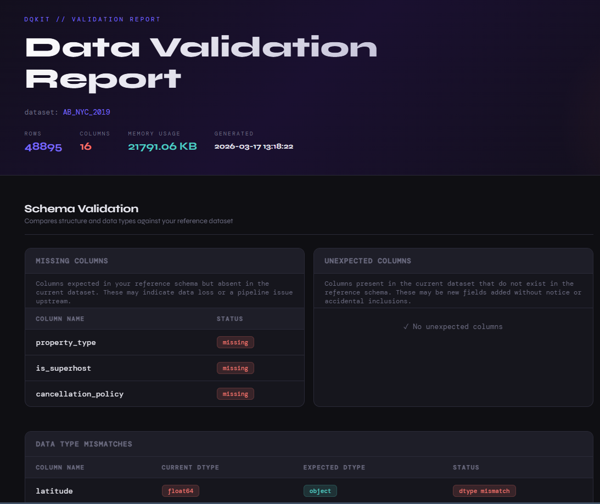

# Data Quality Toolkit (aka DQKit)



## What does it do?
DQKit is a lightweight python tool built for data analysts and scientist who want to validate, profile and understand their datasets quickly. DQKit focuses on four things

- Dataset summary: number of rows, number of columns, total memory usage, and when the report was generated
- Schema validation: compares your current dataset against a reference schema to detect drift in column names and data types. Flags missing columns, unexpected columns, and dtype mismatches with clear, actionable labels
- Quality checks: tracks missing values with severity levels, duplicate rows, and cardinality analysis with notes on potential usefulness in machine learning models
- Memory Usage: total memory consumption for the dataset plus a per-column breakdown, useful when working with large datasets

The interesting part is that all results are compiled into a shareable HTML report that can be generated easily.

# Project structure
```
dqkit/
    dqkit/
        __init__.py                 - makes dqkit a Python package
        base.py                     - abstract BaseCheck class
        schema_validator.py         - SchemaValidator class
        quality_checker.py          - QualityChecker class
        report.py                   - Report class
        templates/
            report.html             - Jinja2 HTML report template
    tests/
        __init__.py
        test_schema_validator.py    - tests for SchemaValidator
        test_quality_checker.py     - tests for QualityChecker
    data/
        airbnb_reference.csv        - sample reference schema dataset
        AB_NYC_2019.csv             - sample current dataset (NYC Airbnb 2019)
    images/
        data_validation_report.png  - a snapshot of the Report
    try_it.py                       - example script demonstrating end-to-end usage
    report_output.html
    requirements.txt
    README.md
```

## Installation

1. Clone the repository:

```bash
git clone https://github.com/yourusername/dqkit.git
cd dqkit
```

2. Create and activate a virtual environment

```bash
python -m venv venv
source venv/bin/activate        # on Mac/Linux
venv\Scripts\activate           # on Windows
```

3. Install dependencies

```bash
pip install requirements.txt
```

## Quick Start

```python
from dqkit.schema_validator import SchemaValidator
from dqkit.quality_checker import Quality
from dqkit.report import Report

#load datasets directly from csv and validate schema
sv = SchemaValidator.from_csv("data/AB_NYC_2019.csv", "data/airbnb_reference.csv")

#run quality checks on the current dataset
quality = Quality(sv.df)

#generate the HTML report
report = Report(sv, quality)
report.generate()

#open report_output.html in your browser
```

Or if you already have your dataframes loaded:

```python
import pandas as pd
from dqkit.schema_validator import SchemaValidator
from dqkit.quality_checker import Quality
from dqkit.report import Report

#replace the files names and paths with yours
df_curr = pd.read_csv("data/AB_NYC_2019.csv") 
df_ref = pd.read_csv("data/airbnb_reference.csv")

sv = SchemaValidator(df_curr, df_ref)
quality = Quality(df_curr)

report = Report(sv, quality)
report.generate()
```

## Modules
1. BaseCheck
This is an abstract class that all the checks inherit from. Why is it important? This is because it enforces a run method on every subclass that inherits from it and validates that only pandas dataframes are accepted as input. Can be found in the base.py file.

2. SchemaValidator
What problem does it solve? 

In most data workflows, you would observe that datasets hardly stay the same. A column might be renamed, or a data type misrepresented. And often times we have two instances of our datasets that may be different in some way that we need to know. So, rather than manually retrieving these columns and data types to cross check, the SchemaValidator does the job.

It's job description involves comparing your current dataset against a reference schema and immediately surfacing any differences from missing columns, unexpected columns and data type mismatches

### How it works?

You provide two dataframes, your current data and a reference schema. SchemaValidator runs two checks:

- check_columns(): highlights columns that are missing from the current data and columns that appear unexpectedly
- check_dtypes(): compares data types for shared columns and tells you if there are any mismatches

3. QualityChecker

It profiles the quality of a dataset. Checks for missing values (with percentage and severity), duplicate rows, and column cardinality with ML-specific recommendations.

4. Report
The Report class ccepts a SchemaValidator and QualityChecker instance, runs both, and renders a HTML report using Jinja2 templating. The output of this process is saved as report_output.html.

## Sample Report

When you run the report.generate() method, it produces a self-contained HTML file you can open in any browser or share with your team.

## Running Tests

```bash
pytest tests/ -v
```

## Finally...

This was designed for data analysts and scientists who want a fast, readable overview of their data before analysis or modelling.
